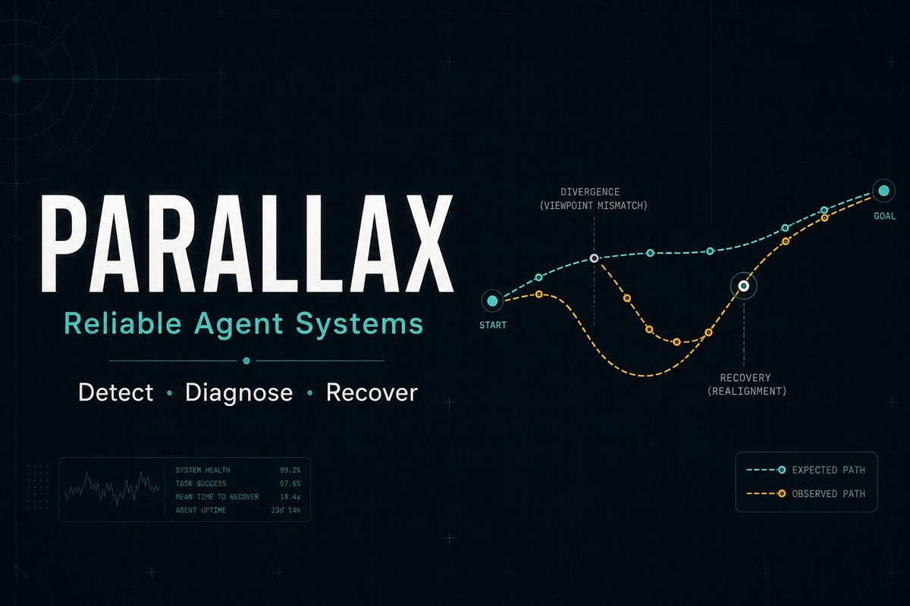
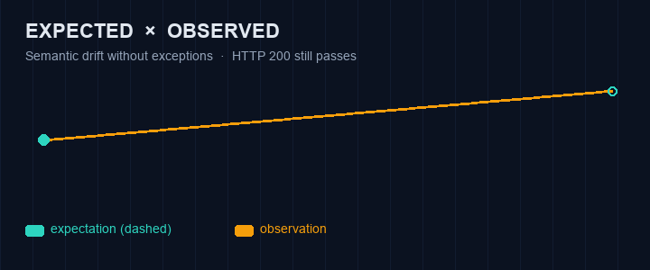
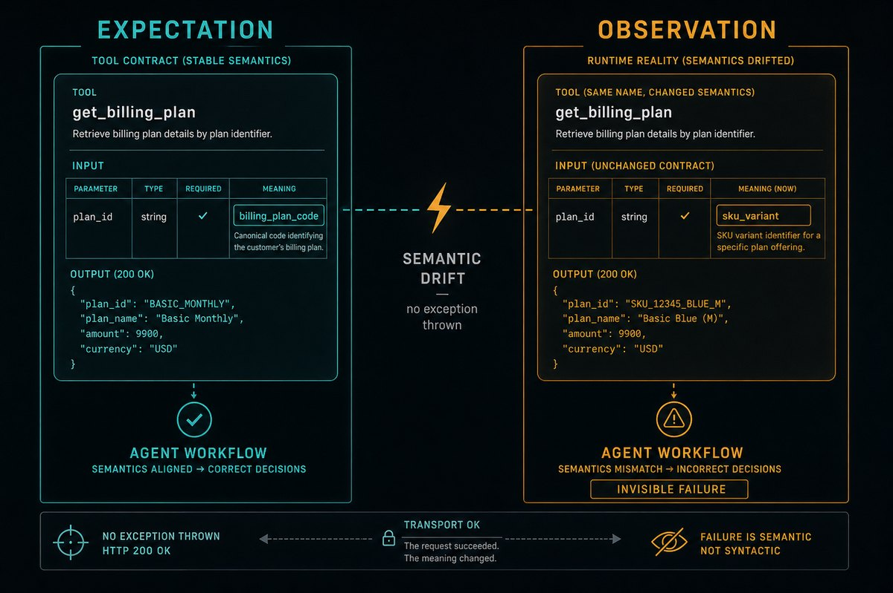
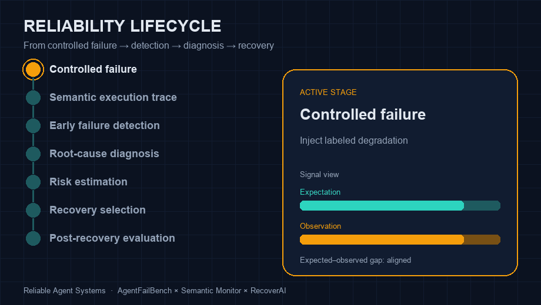
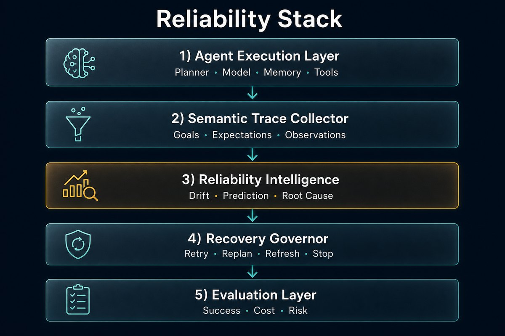
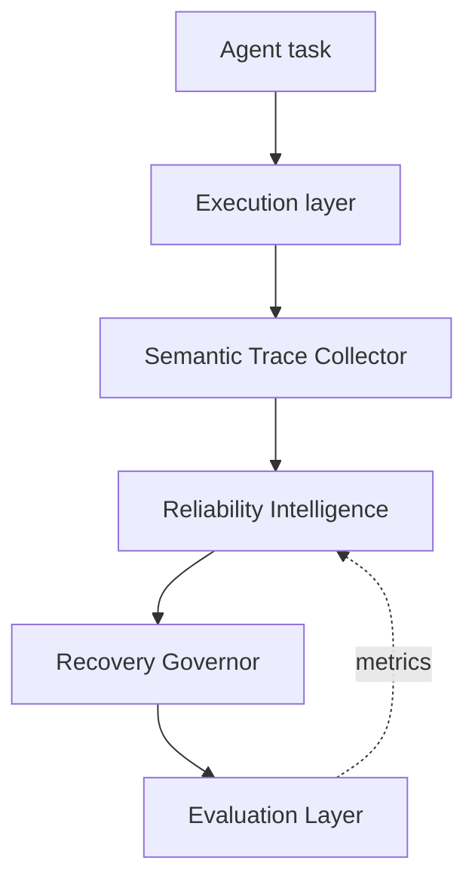

<p align="center">
  
</p>

<h1 align="center">Parallax</h1>

<p align="center">
  <strong>When expectation and observation diverge, reliability is already failing.</strong>
</p>

<p align="center">
  Runtime reliability, diagnosis, and recovery for autonomous AI agents.<br/>
  Research stack: <em>AgentFailBench</em> · <em>Semantic Runtime Monitor</em> · <em>RecoverAI</em>
</p>

<p align="center">
  <a href="https://github.com/askmy-stack/parallax/actions/workflows/ci.yml"></a>
  <a href="https://www.python.org/downloads/"></a>
  <a href="LICENSE"></a>
  <a href="docs/research-proposal.md"></a>
  <a href="docs/roadmap.md"></a>
</p>

---

## Why Parallax?

In optics, **parallax** is the apparent shift of an object when viewed from two positions.

In agent systems, the same failure mode appears as a gap between:

| Viewpoint | Signal |
| --- | --- |
| **Expectation** | What the agent believed a tool, memory, or plan step meant |
| **Observation** | What the environment actually returned |

If those viewpoints drift while HTTP still returns `200`, classic monitors stay quiet — and the task fails later, with the diagnostic window already closed.

<p align="center">
  
</p>

<p align="center">
  <em>Parallax measures that gap early — then diagnoses and recovers.</em>
</p>

### Central question

> How can an autonomous system detect that it is becoming unreliable **before** visible task failure, distinguish the root cause, estimate the risk of continuing, and choose a safe recovery strategy?

---

## The invisible failure

<p align="center">
  
</p>

**Tool semantic drift** is the first vertical slice: schema stays valid, transport succeeds, meaning changes. The agent acts on the wrong world model — and nothing throws.

AgentFailBench injects that class of failure with ground-truth labels so detectors and recovery policies can be evaluated, not just demoed.

---

## Reliability lifecycle

<p align="center">
  
</p>

```text
Controlled failure
      ↓
Semantic execution trace
      ↓
Early failure detection
      ↓
Root-cause diagnosis
      ↓
Risk estimation
      ↓
Recovery selection
      ↓
Post-recovery evaluation
```

---

## Reliability stack

<p align="center">
  
</p>

| Layer | Package | Role |
| --- | --- | --- |
| Benchmark | `agentfailbench/` | Tasks, environments, injectors, ground-truth labels |
| Monitor | `runtime/` | Traces, features, detectors, diagnosis, calibration |
| Recovery | `recovery/` | Policies, actions, constraints, sandbox evaluation |
| Baselines | `baselines/` | Rules, classical ML, sequence models, LLM judges |



---

## Core contributions

| # | Contribution | What you get |
| --- | --- | --- |
| 1 | **Failure taxonomy** | Model · planning · memory · retrieval · tool · data · environment · communication · execution · recovery |
| 2 | **AgentFailBench** | Controlled degradation with first-detectable / final-failure steps |
| 3 | **Semantic Runtime Monitor** | Goals, beliefs, actions, expectations, observations, state changes |
| 4 | **RecoverAI** | Failure-conditioned recovery vs retry-only / restart / generic reflection |

---

## Quick start

Requires **Python 3.12+**.

```bash
git clone https://github.com/askmy-stack/parallax.git
cd parallax

python -m venv .venv
source .venv/bin/activate   # Windows: .venv\Scripts\activate

make install
make test
ras                  # prints package version
```

Optional local telemetry UI:

```bash
docker compose up -d jaeger
# UI → http://localhost:16686
```

Inspect the first benchmark case:

```bash
cat agentfailbench/failures/tool_drift/tool-semantic-drift-001.yaml
```

---

## Repository map

```text
parallax/
├── agentfailbench/     # benchmark cases + injectors
├── runtime/            # semantic monitor + detectors
├── recovery/           # RecoverAI policies
├── baselines/          # comparison methods
├── experiments/        # configs · notebooks · results
├── docs/               # specs · ADRs · roadmap
│   └── assets/         # README visuals
├── examples/           # minimal agent scaffolds
├── tests/              # unit · integration · benchmark
└── paper/              # technical report scaffold
```

---

## Research status

| Milestone | Focus | Status |
| --- | --- | --- |
| **0** | Repository foundation | ✅ scaffolded |
| **1** | Minimal agent environments | next |
| **2** | Failure injection suite | planned |
| **3** | Semantic tracing | planned |
| **4–6** | Detection · diagnosis · recovery | planned |
| **7** | Research release v0.1 | planned |

Full specification: [`docs/roadmap.md`](docs/roadmap.md)  
Condensed proposal: [`docs/research-proposal.md`](docs/research-proposal.md)  
Taxonomy: [`docs/failure-taxonomy.md`](docs/failure-taxonomy.md)

**Near-term experiment:** compare exception monitoring, confidence thresholds, raw telemetry anomaly detection, and semantic expected–observed monitoring on tool semantic drift.

---

## Design principles

1. **Benchmark before framework** — AgentFailBench stays scaffold-agnostic.
2. **Semantics over status codes** — expectations and observations are first-class.
3. **Label everything** — detection lead time and root cause need ground truth.
4. **Recovery is a policy** — not an infinite retry loop.
5. **No false safety claims** — empirical reliability evaluation, not formal guarantees.

---

## Contributing

Research contributions welcome: new failure cases, detectors, recovery policies, and ablation studies.

See [`CONTRIBUTING.md`](CONTRIBUTING.md) and [`CODE_OF_CONDUCT.md`](CODE_OF_CONDUCT.md).

Security reports: [`SECURITY.md`](SECURITY.md).

---

## Citation

```bibtex
@software{parallax2026,
  author  = {Kamineni, Abhinaysai},
  title   = {Parallax: Reliable Agent Systems},
  year    = {2026},
  url     = {https://github.com/askmy-stack/parallax},
  version = {0.1.0}
}
```

Also see [`CITATION.cff`](CITATION.cff).

---

## License

MIT — see [`LICENSE`](LICENSE).

<p align="center">
  <sub>
    Capable agents must not only know how to act.<br/>
    They must recognize when their assumptions are failing — and choose when to retry, adapt, ask for help, or stop.
  </sub>
</p>
